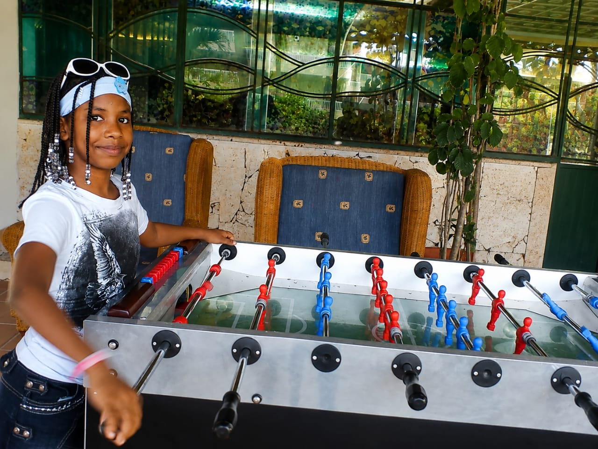
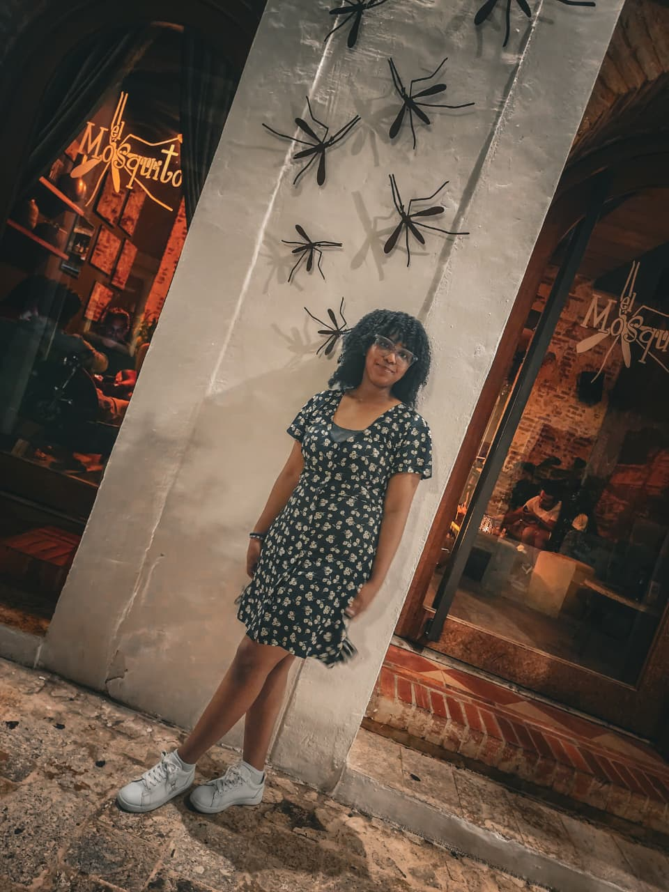
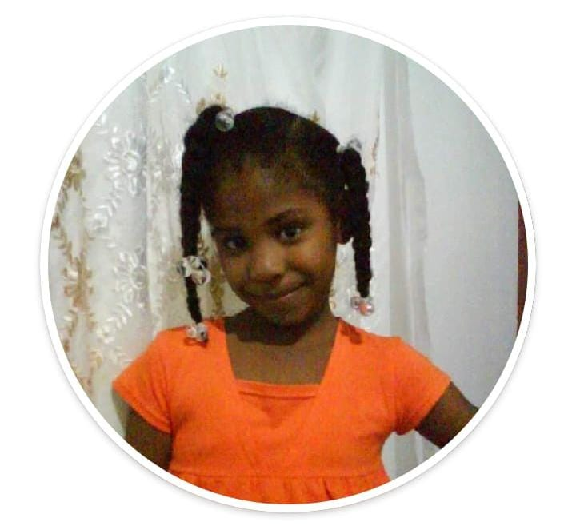
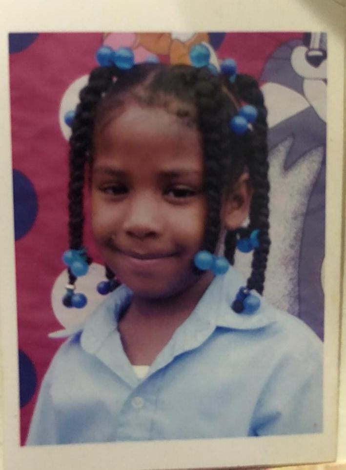
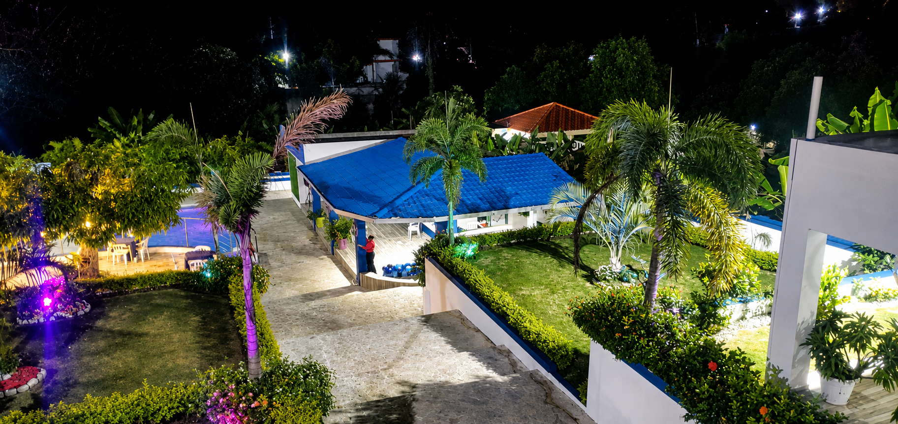
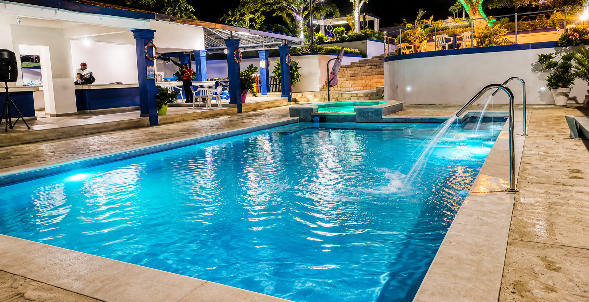

[index-v2.html](https://github.com/user-attachments/files/31190573/index-v2.html)
<!DOCTYPE html>
<html lang="es">
<head>
    <meta charset="UTF-8">
    <meta name="viewport" content="width=device-width, initial-scale=1.0">
    <title>¡Alendy cumple 26! 🎀🍒</title>
    <link rel="preconnect" href="https://fonts.googleapis.com">
    <link rel="preconnect" href="https://fonts.gstatic.com" crossorigin>
    <link href="https://fonts.googleapis.com/css2?family=Montserrat:wght@300;400;600;700&family=Playfair+Display:ital,wght@0,600;1,600;1,700&display=swap" rel="stylesheet">
    
</head>
<body>

    <!-- PARTICULAS DEL FONDO -->
    

    

    
    <canvas id="confetti"></canvas>

    

        
        <!-- SECCIÓN 1: INICIO -->
        

            
🎀 Una celebración especial 🎀

            
            

                
🍒

                
✨

                
🎂

                

                    <!-- CARRUSEL DE FOTOS PROTAGÓNICO -->
                    

                        
                        
                        
                        
                        
                        
                        
                        
                    

                

            

            <h2>Acompáñame a celebrar mi cumpleaños</h2>
            <h1>¡Alendy cumple 26!</h1>
            
            

                🌸🍒🌸
            

            
Un pequeño detalle para hacer de este día algo aún más especial ✨

            
Me encantaría que me acompañes a celebrar mi cumpleaños. Preparé un día hermoso lleno de alegría, sol y buena compañía, y tu presencia es el mejor regalo.

            

                
00
Días

                
00
Horas

                
00
Min

                
00
Seg

            

        

        <!-- SECCIÓN 2: LUGAR Y FECHA -->
        

            <h2>Cuándo y Dónde</h2>
            
¡Prepara tu mejor actitud y tu traje de baño para un día inolvidable!

            

                

                    <i>📅</i>
                    <strong>Fecha</strong>
                    08 de Noviembre
                

                

                    <i>⏰</i>
                    <strong>Hora</strong>
                    10:00 AM
                

                

                    <i>📍</i>
                    <strong>Lugar</strong>
                    Villa Gloria, San Cristóbal
                

            

            <a href="https://maps.app.goo.gl/zQPrrrbGZjWA2Jk99?g_st=aw" target="_blank" class="btn">📍 Abrir en Google Maps</a>

            

                
                
            

        

        <!-- SECCIÓN 3: DRESS CODE -->
        

            <h2>Dress Code</h2>
            
👗🤍👗

            
Código de Vestimenta y Paleta de Colores

            
Para que nuestras fotos queden hermosas y todos estemos en sintonía, he preparado esta paleta de colores sugerida para la ocasión. ¡Elige tu tono favorito y prepárate para brillar!

            
            

                

                    

                    ROSA BEBÉ
                    #F8C8DC
                

                

                    

                    ROSA PASTEL
                    #F4A6C1
                

                

                    

                    ROSA FUERTE
                    #E85D8E
                

                

                    

                    ROJO CEREZA
                    #C9184A
                

                

                    

                    BLANCO
                    #FFFFFF
                

                

                    

                    ROSA MUY CLARO
                    #FFF0F5
                

            

        

        <!-- SECCIÓN 4: APORTE -->
        

            <h2>Detalles del Aporte</h2>
            
💕🏡💕

            
            
Para disfrutar juntos de la villa y hacer que este cumpleaños sea súper lindo e inolvidable, haremos un pequeño aporte de <strong>RD$1,000 por persona</strong>.

            
            

                <h3 style="margin-bottom: 20px; font-size: 1.8rem;">Fechas de Pago 💳</h3>
                
💸 <strong>RD$500</strong> - 30 de Septiembre

                
💸 <strong>RD$500</strong> - 15 de Octubre

            

            
<strong>✨ ¿Qué incluye?</strong> Transporte, estadía en la villa, comida y bebida.

            
<em>Gracias por acompañarme, por compartir este día conmigo y por poner su granito de arena para que todo quede precioso. 🥹🎀</em>

            
¡Lo importante es celebrar juntos y crear recuerdos bonitos! 💗✨

        

        <!-- SECCIÓN 5: CONFIRMACIÓN (RSVP) -->
        

            <h2>Confirma tu Asistencia</h2>
            
Por favor, regístrate aquí. Al confirmar, serás redirigido automáticamente al grupo oficial de WhatsApp del evento.

            

                <form id="rsvp-form">
                    

                        <label for="nombre">Nombre</label>
                        <input type="text" id="nombre" placeholder="Ej. María" required>
                    

                    

                        <label for="apellido">Apellido</label>
                        <input type="text" id="apellido" placeholder="Ej. Pérez" required>
                    

                    

                        <label for="transporte">¿Cómo llegarás a la Villa?</label>
                        <select id="transporte" required>
                            <option value="" disabled selected>Selecciona una opción</option>
                            <option value="incluido">Me iré en el transporte incluido 🚌</option>
                            <option value="independiente">Llegaré de forma independiente 🚗</option>
                        </select>
                    

                    <button type="submit" class="btn" style="width: 100%; font-size: 1.3rem; padding: 20px;">Confirmar y Unirme al Grupo ✨</button>
                </form>
            

        

    

    
</body>
</html>
